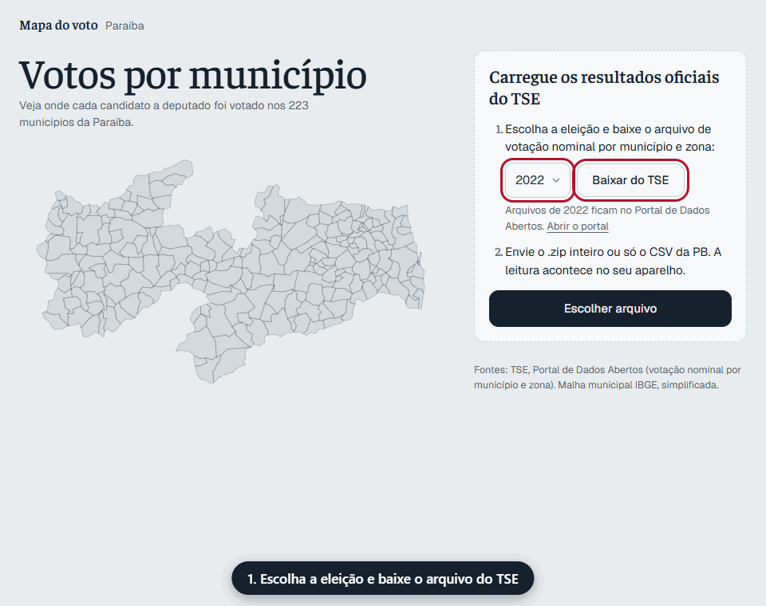
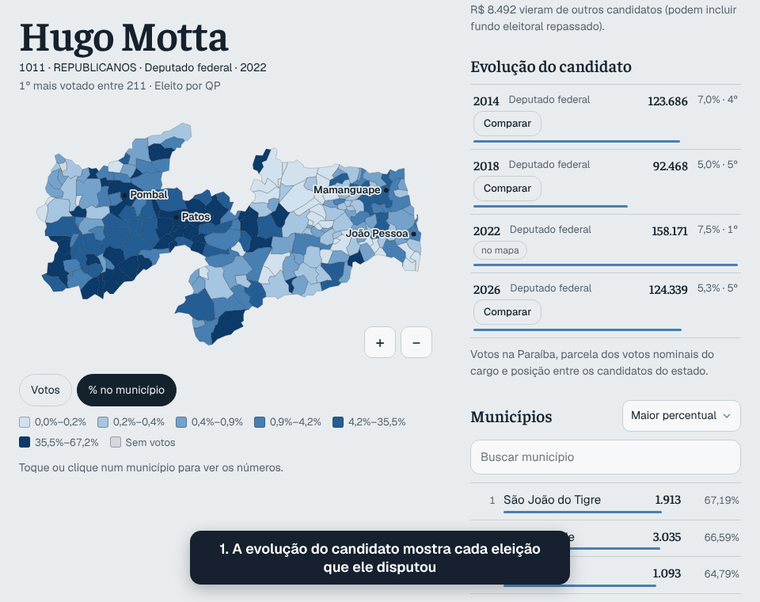
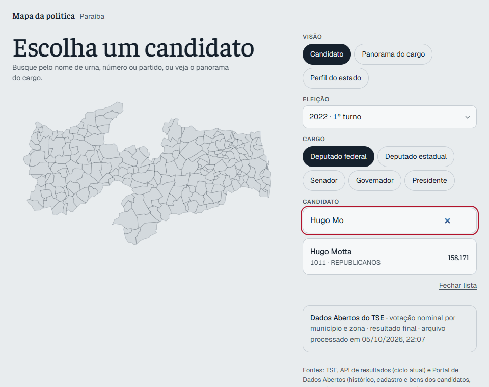
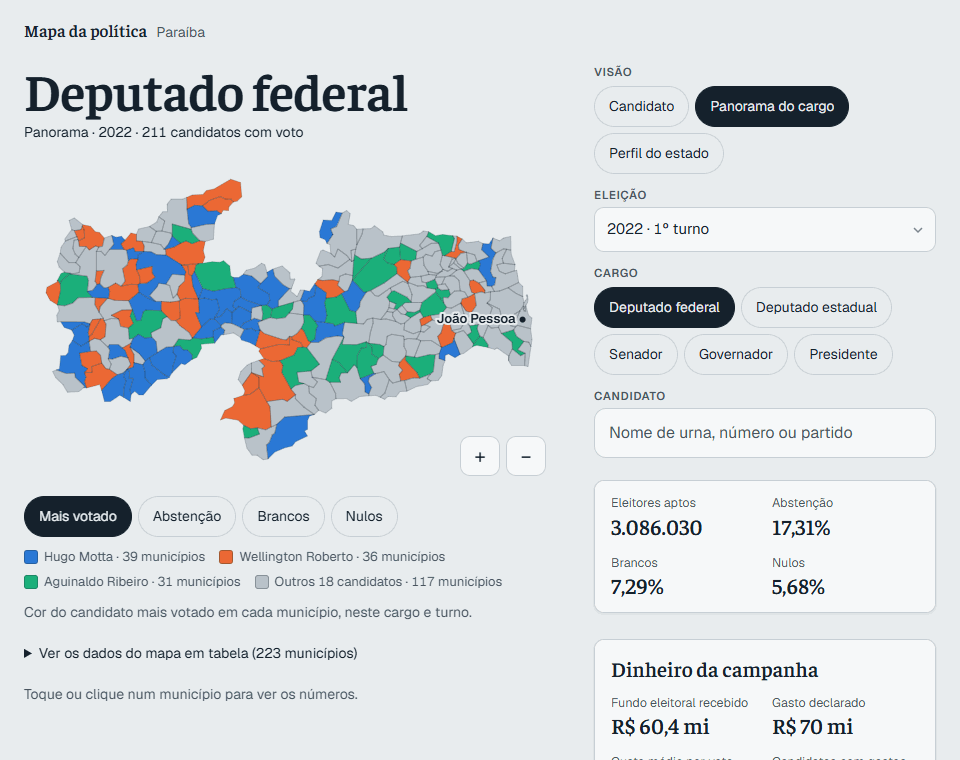

Site: https://calixtoneto.github.io/mapa-do-voto-pb/

# Mapa do voto · Paraíba

Votos de candidatos a presidente, governador, senador, deputado federal e deputado estadual em cada um dos 223 municípios da Paraíba, a partir dos resultados oficiais do TSE.

## Como usar



Abra o site: ele lista todas as eleições disponíveis sozinho, sem precisar baixar nem enviar arquivos. Escolha a eleição (ano e turno), o cargo e o candidato. Clique num município para ver os números e, quando existir, os votos em cada local de votação (escola).

## Comparar a evolução de um candidato



Quando o candidato disputou mais de uma eleição, a seção **Evolução do candidato** mostra os votos dele em cada uma, com a parcela dos votos nominais e a posição. A ligação entre eleições é feita pelo nome completo no TSE, inclusive entre cargos diferentes (por exemplo, vereador em 2016 e deputado em 2018).

Clique em **Comparar** numa delas para ver no mapa onde o candidato ganhou e perdeu votos, com o ranking de variação e, no card, o "antes → depois". A cor mostra a variação dos votos (%) ou a da parcela (pontos percentuais).

O uso pensado é comparar **o mesmo cargo** (e o mesmo turno). É possível comparar cargos ou turnos diferentes, mas o botão traz "(outro cargo)" ou "(outro turno)" e o site mostra um aviso: mudam o tipo de disputa, o número de candidatos e os votos por eleitor (em anos de dois senadores, cada eleitor tem dois votos), então a variação não mede, por si só, crescimento ou queda de apoio.

## Análises

Além do mapa de votos, cada candidato e cada cargo têm análises tiradas dos Dados Abertos do TSE.

**Na ficha do candidato** (botão *Candidato*):



- **Fora da curva**: o que destoa na campanha em relação aos outros candidatos ao mesmo cargo na mesma eleição: uma categoria de gasto (combustível, impressos, veículos…) ou o custo por voto 3 vezes ou mais a mediana dos outros, recursos próprios acima dos bens declarados, um só doador ou fornecedor com metade ou mais do dinheiro, quem doou e também recebeu da campanha e despesas que ficaram sem pagar. Comportamento fora da curva **não é irregularidade**, e o painel diz isso antes da lista.
- **Dinheiro da campanha**: quanto recebeu, quanto declarou ter gasto, **custo por voto**, quanto veio do **fundo eleitoral** e a origem do dinheiro (fundo eleitoral, fundo partidário e partido, doações, recursos próprios e de outros candidatos); a **posição entre os candidatos do cargo** no recebido, no gasto e no fundo eleitoral, com a mediana do cargo; **para onde foi o dinheiro** (todas as categorias de despesa); **quem doou** (os dez maiores doadores, com a parcela de cada um no recebido) e **quem recebeu os pagamentos** (os dez maiores fornecedores); quanto **ficou sem pagar**, quanto veio do **maior doador** e de **recursos próprios**; **doadores e fornecedores em comum** com outras campanhas; **quando o dinheiro chegou** (por semana); e o dinheiro da mesma pessoa **em cada eleição** (recebido, gasto, votos e custo por voto).
- **Quem é**: gênero, cor ou raça, idade, escolaridade, ocupação, se tentou a reeleição, a situação final e o total de bens declarados.
- **Evolução patrimonial**: bens declarados em cada eleição, a variação entre elas (no total e por ano), **de que são os bens** (casa, veículos, aplicações…) e quanto o candidato pôs na própria campanha.
- **Força do voto**: nos cargos proporcionais, a parcela do **quociente eleitoral** e dos votos do partido, e a distância entre o eleito menos votado e o não eleito mais votado; os municípios **onde vai melhor** do que no conjunto; e o **perfil do eleitorado** (mulheres, jovens, idosos, escolaridade) dos municípios de onde vêm os votos.
- **Concentração do voto**: de quantos municípios veio metade dos votos e o número efetivo de municípios (voto de reduto ou espalhado).
- **Dobradinhas prováveis**: para cada outro cargo da mesma eleição (e, para senador, os outros senadores), os candidatos cuja votação sobe e desce nos mesmos municípios. Em cargos com poucos candidatos (governador, senador, prefeito) aparecem todos, inclusive os que andam ao contrário; nos outros, os cinco mais parecidos. Cada um traz a força da correlação (fraca, moderada ou forte).

**No panorama do cargo** (botão *Panorama do cargo*):



- Mapa de **quem venceu** em cada município e de **abstenção, brancos e nulos**, com os totais do estado.
- **Gasto × votos** de todos os candidatos, com diagonais de custo por voto, e rankings de menor e maior custo por voto, mais fundo eleitoral, mais dinheiro recebido e maior gasto.
- **Fundo eleitoral por partido**, com a parcela para mulheres e para pessoas negras (pretas e pardas) e um aviso quando a parcela das mulheres fica abaixo de 30%.
- **Quem disputou e quem se elegeu**: gênero e cor ou raça de candidatos e eleitos.
- **Voto de reduto ou espalhado**: candidatos ordenados pela concentração do voto.
- **Maiores doadores** e **maiores fornecedores** dos candidatos do cargo, somados pelo CPF/CNPJ (que o site não mostra).
- **O dinheiro elege?**: gasto mediano de eleitos e não eleitos e a chance de se eleger em cada faixa de gasto.
- **Partidos**: votos, eleitos, gasto, custo por voto e fundo eleitoral de cada partido.
- **Concentração e reeleição**: parcela do fundo eleitoral que foi para os 10% que mais receberam, índice de Gini do fundo e quantos dos que tentaram se reeleger conseguiram.
- **Por município**: as disputas mais apertadas, onde o voto mais se dividiu ou se concentrou, as maiores altas e quedas da abstenção desde a eleição de 4 anos antes e o perfil do eleitorado de onde vêm os votos dos mais votados.

Cuidados que o site mostra junto dos números:

- **Gasto** é o total de despesas contratadas declaradas ao TSE, sem as doações a outras campanhas (que são gasto de quem recebe). **Custo por voto** é esse gasto dividido pelos votos do candidato na Paraíba.
- Para **presidente**, a campanha é nacional e os votos aqui são só os da Paraíba: o site não mostra o dinheiro dela, só o perfil. Em governador e senador, o dinheiro é da chapa e cobre os dois turnos.
- O dinheiro que veio **de outros candidatos** fica separado, para não ser contado duas vezes (pode incluir fundo eleitoral repassado).
- A **prestação de contas é parcial** até o prazo da prestação final (cerca de 30 dias depois da eleição); o site avisa, e os números mudam quando o workflow roda de novo.
- O **fundo eleitoral** existe desde 2018, e a prestação de contas neste formato também. Em 2014 o site diz que o dado não existe.
- A **regra dos 30% do fundo para mulheres** vale para o total nacional de cada partido; a parcela na Paraíba indica como o dinheiro foi distribuído aqui, não uma irregularidade.
- **Dobradinhas** são candidatos cujas parcelas de voto sobem e descem nos mesmos municípios (correlação): votos no mesmo eleitorado, não prova de acordo político. Correlação negativa quer dizer que um vai melhor onde o outro vai pior; abaixo de 0,3 (em módulo) a relação é fraca.
- O **perfil do eleitorado** é o dos municípios de onde vêm os votos, ponderado pelos votos: descreve os lugares, não quem votou no candidato (o voto é secreto).
- O **quociente eleitoral** soma os votos de legenda quando o arquivo do TSE traz; senão, o site avisa que a conta é sem legenda. As vagas são os eleitos do cargo no cadastro do TSE.
- **Doadores e fornecedores em comum** mostram quem se liga a mais de uma campanha, não irregularidade nem acordo.
- **Bens** são valores nominais, sem correção pela inflação; a ligação entre eleições é pelo nome completo, como na evolução do candidato.
- No mapa de quem venceu, só os três candidatos que mais venceram têm cor própria; com mais cores elas deixam de ser distinguíveis, inclusive para daltônicos.

### De onde vêm as análises

O gerador `scripts/gerar-analises.mjs` grava, ao lado dos arquivos de votação:

| Arquivo | Fonte do TSE | Conteúdo |
|---|---|---|
| `ANO-candidatos.json` | Candidatos (`consulta_cand`) e bens (`bem_candidato`) | Perfil, total de bens e os maiores tipos de bem de cada candidato |
| `ANO-financas.json` | Prestação de contas dos candidatos (receitas, despesas contratadas e pagas) | Dinheiro por origem, gasto, repasses, maiores despesas e os maiores doadores; por candidato, os maiores doadores e fornecedores, o recebido por semana e o pago; a lista dos maiores doadores e fornecedores e de quem se liga a mais de um candidato |
| `ANO-tTURNO-comparecimento.json` | Detalhe da votação por município e zona | Aptos, comparecimento, brancos, nulos e (quando o TSE traz) votos de legenda por município, cargo e turno |
| `ANO-eleitorado.json` | Perfil do eleitorado por seção (`perfil_eleitor_secao`) | Eleitores, mulheres, jovens, idosos e escolaridade por município |
| `analises.json` | — | O que existe de cada ano (o site só pede os arquivos que existem) |
| `patrimonio.json` | — | Bens da mesma pessoa em cada eleição |
| `dinheiro.json` | — | Recebido, gasto e votos da mesma pessoa em cada eleição |

Para gerar ou atualizar: **Actions → Gerar análises → Run workflow** (em branco, refaz todos os anos; ou informe, por exemplo, `2022 2026`). O workflow **Atualizar dados de uma eleição** também gera as análises do ano. Localmente: `npm run analises -- 2022`.

## De onde vêm os dados

Os resultados ficam no repositório, em `public/data/eleicoes/`: um `ANO-tTURNO.json` por eleição e turno, o `ANO-tTURNO-locais.json` com os votos por escola (carregado só ao clicar num município) um `index.json` que o site lê para listar as eleições e um `pessoas.json` que liga o mesmo candidato entre eleições (pelo nome completo). O site é totalmente estático: o navegador do visitante nunca chama o TSE.

O gerador (`scripts/gerar-dados.mjs`) segue esta ordem para cada ano:

1. **Dados Abertos do TSE** (CSV de votação nominal por município e zona). O presidente vem do arquivo nacional (`_BRASIL.csv`) do mesmo .zip.
2. **API de resultados do TSE**, só para o que o CSV ainda não tem: um 2º turno recém-apurado ou um cargo que o arquivo ainda não traz (hoje, o presidente de 2026). A API só guarda o ciclo atual e o anterior.
3. **CSV por seção**, para o detalhe por local de votação (de 2018 em diante; em 2014 o TSE não publicou o nome do local).

Eleições já geradas: 2014, 2018, 2022 e 2026.

## Nas próximas eleições

No GitHub, abra **Actions → Atualizar dados de uma eleição → Run workflow** e informe o ano. O workflow gera os arquivos, commita em `public/data/eleicoes/` e dispara a publicação do site. Marque "refazer" enquanto a apuração estiver em andamento ou para pegar o 2º turno.

O mesmo pode ser feito localmente, e o workflow só repete esses passos:

```bash
npm install
npm run eleicoes -- 2030 --forcar   # gera public/data/eleicoes/2030-t*.json
git add public/data && git commit -m "dados: eleição 2030" && git push
```

## Desenvolvimento

```bash
npm install
npm run dados       # malha (IBGE) e tabela TSE→IBGE
npm run eleicoes    # gera os anos que ainda não existem (use -- ANO para escolher; --forcar para refazer)
npm run dev         # http://localhost:5173
```

## Testes

```bash
npm test
```

Rodam offline, em menos de um segundo, sem baixar nada do TSE:

- `test/caracterizacao.test.mjs` é um *golden master*: monta um cenário pequeno de 2022 com os mesmos formatos do TSE (zips em `tmp/` e um `fetch` falso), roda o gerador inteiro e compara a saída com `test/fixtures/esperado/`. Se uma mudança na saída for intencional, regrave com `ATUALIZAR_ESPERADO=1 npm test` e revise o diff dos arquivos esperados.
- `test/unidade/` testa cada regra isolada: divisão do CSV, filtro de voto branco, nulo e de legenda, nomes `#NULO#`, poda de candidaturas anuladas, ligação de pessoas entre eleições e o que é pedido à API.

## Organização do gerador

| Pasta | O que tem |
|---|---|
| `scripts/gerar-dados.mjs` | Linha de comando: escolhe os anos e encadeia as etapas |
| `scripts/gerar-analises.mjs` | Linha de comando das análises: cadastro, bens, prestação de contas e comparecimento |
| `scripts/eleicao/` | Configuração (UF, cargos), conversão TSE→IBGE e a apuração (soma de votos) |
| `scripts/fontes/` | Uma fonte por arquivo: CSV por município, API de resultados, CSV por seção e tabela de locais |
| `scripts/analises/` | Regras das análises: classificação do dinheiro, perfil, comparecimento, patrimônio e o escopo do site |
| `scripts/saida/` | Poda dos locais, `pessoas.json`, `index.json`, arquivos das análises e escrita |
| `scripts/lib/` | CSV do TSE e acesso à rede (retentativa, paralelismo limitado, cache em disco, leitura de .zip) |

Cada fonte separa o tratamento de uma linha (função pura, testada sem .zip) da leitura do arquivo.

## Stack

Preact + htm, Canvas 2D, SVG (gráfico gasto × votos), módulos ES nativos para as análises (`public/js/*.mjs`), TopoJSON (malha IBGE simplificada com mapshaper) e fflate (só nos scripts). Sem etapa de build: a pasta `public/` é o site.

## Fontes

- TSE: Portal de Dados Abertos (votação nominal por município e zona; votação por seção; detalhe da votação; candidatos; bens de candidatos; prestação de contas eleitorais) e API de resultados.
- Malha municipal: IBGE, via tbrugz/geodata-br.
- Tabela TSE↔IBGE: betafcc/Municipios-Brasileiros-TSE.
